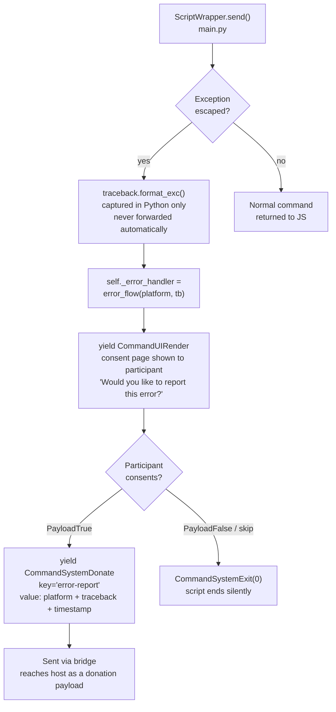

# Error Handling

There are three categories of error in the system, each handled differently.
The dividing lines are chosen to protect participant PII.

---

## Category 1: Expected extraction errors

These are foreseeable failures during file parsing — a missing file in the
zip, a malformed CSV, an unexpected encoding. They are caught inside
`extract_data()`, counted by exception type, and reported as a summary after
extraction completes.

**How it works:**

1. `ZipArchiveReader` catches parsing exceptions internally and increments
   `errors[ExceptionType.__name__]` in the shared `Counter`
2. `extract_data()` returns `ExtractionResult(tables=..., errors=errors)`
3. `FlowBuilder.start_flow()` reads `result.errors` and formats the counts:
   `"errors: FileNotFoundInZipError×2, KeyError×1"`
4. This string is forwarded via `ph.emit_log()` → Path A → host

**What the host sees:** Exception type names and counts. No messages, no
tracebacks, no file contents.

**Where errors accumulate:** `packages/python/port/helpers/extraction_helpers.py`
(`ZipArchiveReader`) and in per-file functions in each platform module.

---

## Category 2: Uncaught Python exceptions

If an exception escapes `extract_data()` — or any other part of the script
generator — `ScriptWrapper.send()` catches it before it can propagate into
the JS engine.

**Key behaviours:**

- The traceback is shown to the participant on screen, so they can see what
  went wrong. It is not forwarded to the host without their explicit consent.
- If the participant consents, the traceback is donated as structured JSON to
  the key `"error-report"`.
- If the participant declines, the script ends silently — no error is recorded
  anywhere the host can see.
- Once `self._error_handler` is set, all subsequent `send()` calls are routed
  through `error_flow` until it completes.

**What the host sees:** Either nothing, or a full donation payload containing
the traceback — but only with consent.

---

## Category 3: JavaScript-side errors

Errors originating in JavaScript (worker crashes, unhandled promise
rejections, `window.onerror` events) never touch Python or `error_flow`.
They go through [Path B of the logging system](06-logging.md#path-b-js-logforwarder)
directly to the host.

**What the host sees:** Error level log entries with message and context
(memory usage, filename, line number). No participant data.

---

## PII safety boundary

The architecture is designed so that raw exception text — which may contain
participant data (file paths, field values, etc.) — is never forwarded to the
host without consent.

| Path | Raw exception text reaches host? |
|---|---|
| `emit_log` (Path A) | No — counts and type names only |
| `LogForwarder` (Path B) | No — JS errors only, no Python tracebacks |
| `error_flow` donation | Only with explicit participant consent |
| `logger.error(...)` (Python logging) | No — browser console only |

This boundary is documented in ADR AD0009.

The critical design decision is that `ScriptWrapper` catches exceptions
*before* they can propagate to the JS engine. If they reached the JS engine,
`WorkerProcessingEngine.worker.onerror` would catch them and forward them to
`LogForwarder`, which would send them to the host without any consent step.
`ScriptWrapper` prevents this by intercepting the exception in Python and
routing it through `error_flow` instead.

---

## Key files

| File | Role |
|---|---|
| `packages/python/port/main.py` | `ScriptWrapper`, `error_flow()` |
| `packages/python/port/helpers/extraction_helpers.py` | `ZipArchiveReader` — catches extraction errors |
| `packages/python/port/api/d3i_props.py` | `ExtractionResult.errors` Counter |
| `packages/python/port/helpers/flow_builder.py` | Formats error counts for `emit_log` |
| `packages/feldspar/src/framework/processing/worker_engine.ts` | `worker.onerror` — JS-side catch |
